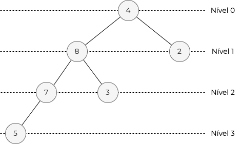

# Binary Heap
`Binary Heap` ou `Heap Binário` é uma estrutura de dados abstrata muito utilizada em contextos dinâmicos em que precisamos inserir e remover elementos de forma ordenada, como em `Priority Queues` (`Filas de Prioridade`), em alguns algoritmos de otimização baseados em grafos, como `Dijkstra's` para obtenção de menor caminho, e para o algoritmo de ordenação `Heap Sort`.

## Definição
`Binary Heap` é um subconjunto da estrutura de dados abstrata `Heap` e da estrutura de dados `Binary Tree` (`Árvore Binária`), tal que um `Binary Heap` é uma `Binary Tree` balanceada que todo nó respeite uma hierarquia sendo ordenados de forma crescente (`Min Binary Heap`) ou decrescente (`Max Binary Heap`). Vamos entender um pouco da herança de cada uma dessas estruturas.

### Binary Tree
O `Binary Heap` herda da `Binary Tree` a estrutura de árvore e a propriedade de binariedade. Desta forma há um nó raiz, que pode conter nós filhos, e nós filhos que podem conter outros nós filhos, sendo que cada nó pode conter no máximo dois filhos, um à sua esquerda e um à sua direita. Uma `Binary Tree` não requerer nenhuma ordem dos seus valores. Essa estrutura é ilustrada da forma:

Desta forma temos uma árvore com 3 elementos. O nó raiz (4) que contém o filho esquerdo (8) e o filho direito (2). Nesse exemplo os nós (8) e (2) não possuem nenhum filho. É importante mencionar que nenhum nó é obrigado a ter filhos para representar uma árvore, e estes nós sem filhos são chamados nós folhas.  O exemplo a seguir adiciona um nível na árvore:

Aqui os nós (8) e (2) agora possuem filhos, tendo o nó (8) um filho esquerdo e um direito e o nó (2) apenas o filho esquerdo. Dessa forma os nós folhas são os nós (7), (3) e (1).

### Balanced Binary Tree
Uma `Balanced Binary Tree`, ou `Árvore Binária Balanceada`, é uma `Árvore Binária` que em que os nós folhas estão no máximo a um nível de distância. O nível de um nó é a relação do nó com a raiz, ou seja, a raiz está no nível 0, os filhos da raiz estão no nível 1, os netos da raiz estão no nível 2 e assim sucessivamente. Dessa forma, o exemplo que foi apresentado anteriormente constitui uma `Árvore Binária Balanceada`:

Porém, se adicionarmos um novo filho ao nó (7) e removermos o nó (1), ela se torna uma árvore desbalanceada pois teremos nós folhas no nível 1 e no nível 3, tendo mais de um nível de distância:

### Min/Max Binary Heap
Um `Min Heap` é uma árvore em que os nós filhos são sempre maiores ou iguais ao nó pai, enquanto um `Max Heap` é uma árvore em que os nós filhos são sempre menores ou iguais ao nó pai. Ambos os heaps possuem a propriedade de serem `Balanced Tree`, tendo os nós folhas a no máximo 1 nível de distância, e um `Binary Heap` possuí as propriedades de uma `Binary Tree`, tendo cada nó possuindo no máximo dois nós filhos.

Então, somando todas as propriedades, um `Min Binary Heap` é uma `Balanced Binary Tree` (`Árvore Binária Balanceada`) em que os valores filhos são sempre maiores ou iguais ao pai e um `Max Binary Heap` é uma `Balanced Binary Tree` (`Árvore Binária Balanceada`) em que os valores são sempre menores ou iguais ao pai. A seguir estão alguns exemplos de `Min Binary Heap` e `Max Binary Heap`.

Podemos tomar o exemplo _a_) tanto como `Min Binary Heap` como `Max Binary Heap`, pois um único elemento, o elemento raíz, pode constituir ambos os heaps.

Os exemplos _b_) e _c_) demonstram exemplos de `Min Binary Heap` e `Max Binary Heap`, respectivamente, com um nível de profundidade. Os exemplos _d_) e _e_) demonstram heaps com dois níveis de profundidade e nem todos os nós possuem filhos esquerdos e direitos, mas ainda assim ambos são `Binary Heaps` válidos, pois possuem as propriedades de ordenação e `Àrvores Binárias Balanceadas`.

## Operações
TO DO

## Análise de Complexidade
TO DO